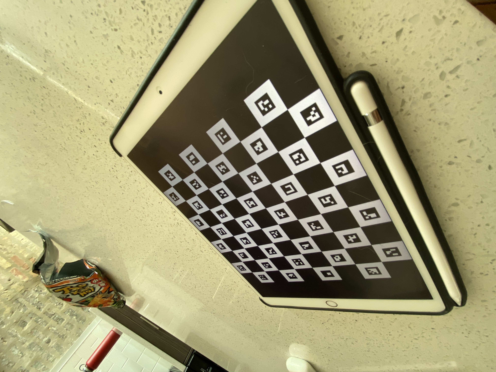

# charuco calibration for behavioral rig

The goal is to use charuco chessboard to auto + real-time calibrate the
top camera (at least).

### an example chessboard would be like:

### an example of video tracking the corners would be like:

### Calibration testing picture
1.  find out corners from the video/pictures/real-time recording
2.  calculate camera matrix
3.  calculate distortion coefficients
4.  undistort the testing picture

### result (failed, need more investigation)

